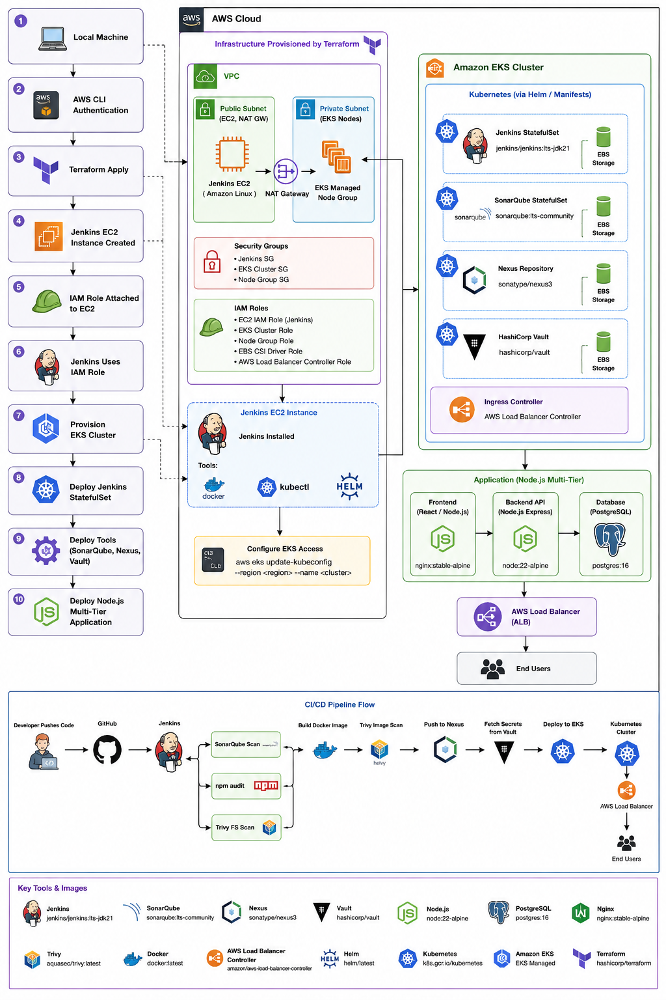

# 🚀 End-to-End DevSecOps CI/CD Pipeline on AWS EKS

> A complete DevSecOps implementation that automates **Build → Scan → Secure → Deploy** using Jenkins, Vault, Kubernetes, and AWS.

---

## 📌 Workshop Overview

This project demonstrates how to build a secure and automated CI/CD pipeline on **Amazon EKS** while following DevSecOps best practices.

Instead of storing credentials inside Jenkins, **HashiCorp Vault** is used to securely manage secrets. Every code change automatically triggers a pipeline that builds, scans, pushes, updates Kubernetes manifests, and deploys the latest version to EKS.

---
## 📌 Architecture Flow:



## 🛠️ Tech Stack

| Category               | Tools                              |
| ---------------------- | ---------------------------------- |
| ☁️ Cloud               | AWS, Amazon EKS                    |
| ⚙️ CI/CD               | Jenkins                            |
| 🔐 Secrets             | HashiCorp Vault                    |
| 📦 Container           | Docker                             |
| ☸️ Orchestration       | Kubernetes                         |
| 🔍 Code Analysis       | SonarQube                          |
| 🛡️ Security Scan       | Trivy                              |
| 📚 Artifact Repository | Nexus Repository                   |
| 🚪 Ingress             | AWS Load Balancer Controller (ALB) |
| 📝 SCM                 | Git & GitHub                       |

---

## ⚡ Pipeline Workflow

```text
Developer
    │
    ▼
GitHub Push
    │
    ▼
Jenkins Pipeline
    │
    ├── 📥 Checkout Code
    ├── 🔨 Build (Maven)
    ├── 🔍 SonarQube Scan
    ├── 🛡️ Trivy Scan
    ├── 🐳 Build Docker Image
    ├── 📤 Push to Docker Hub
    ├── 🔐 Retrieve Secrets from Vault
    ├── 📝 Update Kubernetes Manifest
    └── 🚀 Deploy to Amazon EKS
               │
               ▼
        AWS Application Load Balancer
               │
               ▼
          Web Application
```

---

## ✨ Key Features

* 🚀 Automated CI/CD Pipeline
* ☸️ Kubernetes Deployment on Amazon EKS
* 🔐 Dynamic Secret Management using Vault
* 🔍 Continuous Code Quality Analysis
* 🛡️ Container Vulnerability Scanning
* 🐳 Docker Image Automation
* 📦 Nexus Artifact Repository
* 🌐 ALB Ingress Configuration
* 📈 Production-style DevSecOps Workflow

---

## 📋 Prerequisites

| Requirement    | Description                     |
| -------------- | ------------------------------- |
| ☁️ AWS Account | For EKS and cloud resources     |
| 🐳 Docker      | Build container images          |
| ☸️ Kubernetes  | EKS Cluster                     |
| 🔧 kubectl     | Kubernetes CLI                  |
| 📦 Helm        | Install Kubernetes applications |
| 🏗️ Terraform   | Infrastructure provisioning     |
| 💻 Jenkins     | CI/CD Automation                |
| 🔐 Vault       | Secret Management               |
| 📚 GitHub      | Source Code Repository          |

---


## 🎯 What You'll Learn

✅ Build secure CI/CD pipelines

✅ Deploy applications to Amazon EKS

✅ Integrate Jenkins with Kubernetes

✅ Secure credentials using Vault

✅ Scan code using SonarQube

✅ Scan images using Trivy

✅ Deploy applications automatically

✅ Configure AWS ALB Ingress

✅ Troubleshoot real-world DevSecOps issues
